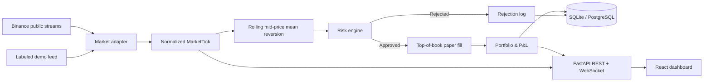

# Live Paper Trading Engine

*A real-time, risk-controlled paper trading system built on public cryptocurrency market data.*

**Paper only. No exchange credentials. No real orders. No profit claims.** Private build under review; there is no verified public deployment URL yet. A local demo runs with labeled synthetic quotes; live mode streams BTC/USDT and ETH/USDT best bids/asks and trades from Binance's public market-data-only WebSocket.

## Architecture



See [architecture](docs/ARCHITECTURE.md), [strategy](docs/TRADING_STRATEGY.md), [risk](docs/RISK.md), [execution/accounting](docs/EXECUTION.md), and [demo guide](docs/DEMO.md).

## Strategy in plain language

1. Read a current best bid and ask. The mid-price is their average.
2. Build a rolling mean and standard deviation using **only previous** mid-prices.
3. A sufficiently low z-score proposes a paper long. A sufficiently high z-score proposes a simulated short (negative position). Short borrow and margin are not modeled.
4. When a long moves back toward the mean, propose a paper sell to exit.
5. Every proposal must pass risk; every simulated fill carries the rule, z-score, quote and cost assumptions. No trades are guaranteed.

The `WINDOW_SIZE`-like setting here is `STRATEGY_WINDOW`; `ENTRY_Z` and `EXIT_Z` are environment-configurable. This is a systems demonstration, not a validated alpha strategy.

## Execution and risk

A paper buy crosses the quoted ask, a sell the quoted bid, then adds configured fixed slippage and fees. Requests larger than visible top-of-book size are rejected. The risk path checks stale/invalid quotes, per-asset position limits, minimum notional, available virtual cash, max UTC daily mark-to-market loss, and a manual kill switch. Gross short exposure is capped by virtual capital; short proceeds do not become real cash. Position is not flattened automatically on halt. Top-book liquidity is not a real exchange fill guarantee; no queue position, hidden liquidity, or market impact is modeled.

Paper equity = cash + sum(position quantity × latest mid-price). Net return = equity / initial capital - 1. Maximum drawdown is the largest prior-peak-to-equity fall sampled in a run. Equal-weight BTC/ETH buy-and-hold allocates half of initial virtual capital to each first observed midpoint, then marks those units to subsequent midpoints; it excludes benchmark fees/spread, so it is not an execution-matched comparator. Strategy P&L includes its simulated fees and slippage. A brief live run is not evidence of edge. See [execution](docs/EXECUTION.md).

## Run locally

Python 3.10+ and Node 22+:

```sh
python3 -m venv .venv
. .venv/bin/activate
pip install -r requirements-dev.txt
cp .env.example .env     # replace placeholder tokens; shell does not load .env automatically
export MODE=demo DATABASE_URL=sqlite:///./paper.db CONTROL_TOKEN="$(python3 -c 'import secrets; print(secrets.token_urlsafe(32))')"
uvicorn apps.backend.main:app --host 127.0.0.1 --port 8000
# in another terminal:
cd apps/frontend && npm ci && npm run dev
```

Visit http://localhost:5173 . Vite proxies REST and WebSocket to the backend. For a single-origin production-style local preview, run `npm run build` in `apps/frontend` first; then FastAPI serves `dist` at http://localhost:8000 . Use `MODE=live` for the public feed, which requires an internet connection and may be regionally blocked. The market-data-only host is documented by [Binance](https://developers.binance.com/docs/binance-spot-api-docs/faqs/market_data_only); [stream payloads](https://developers.binance.com/docs/binance-spot-api-docs/web-socket-streams).

### Docker Compose / PostgreSQL

```sh
cp .env.example .env
# Set strong unique CONTROL_TOKEN and POSTGRES_PASSWORD in .env; set MODE=live when ready.
docker compose up --build
# open http://localhost:8000
```

The Compose database has a persistent named volume. Stop with `docker compose down`; `down -v` deletes it. One app replica only. `/health` reports connection state; `/docs` lists APIs. No exchange key is needed or accepted.

### Tests and checks

```sh
.venv/bin/pytest -q tests
.venv/bin/ruff check apps tests
cd apps/frontend && npm ci && npm run lint && npm run build
```

## Cloud deployment

`Dockerfile` builds frontend and backend together; `render.yaml` describes one Docker web service and PostgreSQL database. On Render, connect this repository, deploy the Blueprint, set `CONTROL_TOKEN` to a private high-entropy value (the blueprint generates one), set `MODE=live`, confirm the database URL uses the internal DB, and verify `/health`, `/api/market`, `/ws`, and the actual dashboard over HTTPS/WSS. Render free services may sleep and stop streaming between visits; this cannot guarantee a continuously active trading demonstration. On any cloud host choose an always-on instance for continuous monitoring, one replica, HTTPS proxy with WebSocket upgrade, and durable PostgreSQL. No deployed application is claimed until its actual URL and behavior are checked. Local Docker build could not be verified in the original authoring workspace because Docker was unavailable.

## Interview talk track

- Why normalize provider-specific events before strategy code?
- Why does the z-score baseline exclude the current quote?
- Why are best bid/ask and spread part of the fill rather than filling at mid?
- How do slippage, fees, and top-of-book size make the sim less optimistic?
- Where can a signal be rejected, and what does a kill switch leave open?
- Why mark to mid and why does the comparison still favor the benchmark?
- What happens when the quote stream disconnects or on process restart?
- Why use WebSocket for live updates and PostgreSQL for audit records?
- Why is this system paper-only, and what is missing for real-money trading?

## Limitations and evidence

This code does not implement real borrow/locate, margin requirements, full-depth order books, maker queue priority, hidden liquidity, trading API requests, tick-perfect persistence, multi-process state coordination, or independent exchange reconciliation. The local tests and source code are not evidence of continuous uptime or of real-money profitability. No fabricated live performance figures are published. The README demo-media slot remains unfilled until a genuine captured runtime is recorded and visually checked.
