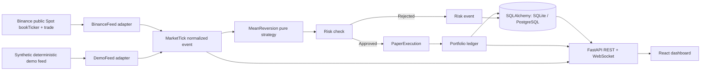

# Architecture and trust boundary

The app runs one backend process, one strategy state, one in-memory portfolio, and one SQL database. The market adapter only calls an anonymous **market-data-only** WebSocket host. There is no authenticated exchange client, order endpoint, or trading key. A single event loop processes quote updates in order per connection. Other providers can emit `MarketTick` objects without changing the strategy, risk, or execution modules. Trade events update the latest trade display but do not independently advance the signal because book and trade streams have no guaranteed cross-stream atomic ordering.

`bookTicker` supplies best bid/ask and visible top-level sizes, not the full L2 book. The simulator permits fills only up to the displayed top size, adds fixed slippage and fees, and explicitly cannot infer hidden liquidity, queue priority, or market impact. Sequence `u` filters duplicates/out-of-order top-book messages per symbol. The connection clears cached quotes and sequence IDs when reconnecting; stale quotes cannot pass risk. Top-book stream sequence IDs are **not** a full book delta-gap proof. For full-depth modeling one would need snapshot/diff-depth synchronization.

A backend restart creates a **new** paper session, leaving prior session records in the database. It does not try to pick up in-flight positions from an uncertain state. Reset is a new session too. One active backend replica is required, not horizontal autoscaling. Source-specific timestamps and processing receive time are kept separately where available; `bookTicker` has update ID but not an event timestamp, so the normalized quote timestamp is local receive time.

The browser gets read-only snapshots over `/ws`, reconnecting with backoff, and can query REST endpoints. Mutating controls require the `X-Control-Token` secret; a public dashboard cannot operate controls without it. The control token is not embedded in JavaScript or a URL. This is a demonstration boundary, not a multi-user authentication system. It must not be exposed as an open production trading controller.

## Scale and real-money separation

At 100+ symbols, a single synchronous DB write per signal/fill can bottleneck. Use a bounded event queue, symbol partitions, backpressure, batched writes, and a durable outbox with idempotent IDs. Keep risk in the order path and monitor data freshness per symbol. None of that is implemented here. Before *any* real-money system, this simulation would need an entirely separate authorization, broker API integration, reconciliation, compliance, order-state machine, capital controls, operational ownership, and audited deployment. This project deliberately provides none of those paths.
